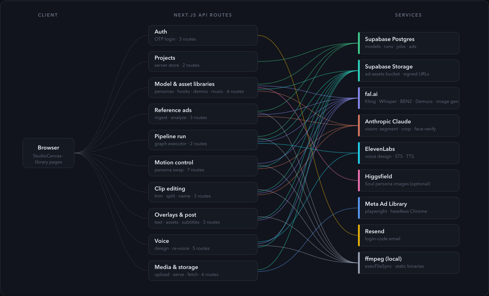

# Ad-Studio

Clone an ad, swap the model, then scale it across many models. Ad-Studio ingests a reference video ad, swaps in a synthetic persona (face + voice), re-composites it, and fans the same ad out across an entire persona library — all through a node-graph editor.

## API map

Every browser request goes through Next.js route handlers under `/api/*`, which fan out to Supabase, four AI providers, and local ffmpeg:

[](docs/api-map.html)

The interactive version — hover a route group or service to trace its connections, plus a full endpoint catalog — is at [`docs/api-map.html`](docs/api-map.html) (open locally in a browser).

For the full system write-up (pipeline engine, frontend, data/auth layers, AI integrations, gotchas), see [`ARCHITECTURE.md`](ARCHITECTURE.md).

## Getting started

```bash
npm install
npm run dev
```

Open [http://localhost:3000](http://localhost:3000). You'll need a `.env` with at least `DATABASE_URL`, `SUPABASE_URL`, `SUPABASE_SERVICE_ROLE_KEY`, `FAL_KEY`, `ELEVENLABS_API_KEY`, and `AUTH_SECRET` — see the Configuration section of [`ARCHITECTURE.md`](ARCHITECTURE.md#5-configuration) for the full list.

Database schema is managed with Drizzle:

```bash
npm run db:push      # push schema to Supabase
npm run db:studio    # browse tables
```
